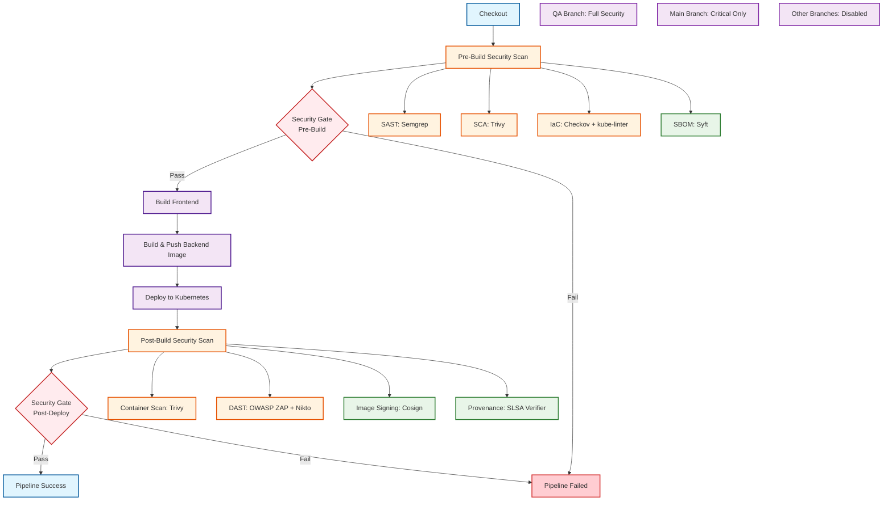

# 🔒 DrillQuiz Security Scan Guide

## 📋 Overview

This document is a comprehensive guide to the DrillQuiz project's security scanning system. It covers the configuration, usage, and result interpretation methods of various security scanning tools that run in the CI/CD pipeline.

## 🏗️ Architecture

### Pipeline Structure

#### DAG Chart


#### Branch-Specific Security Configuration

| Security Feature | QA Branch | Main Branch | Other Branches |
|------------------|-----------|-------------|----------------|
| SAST (Semgrep) | ✅ | ❌ | ❌ |
| SCA (Trivy) | ✅ | ❌ | ❌ |
| IaC (Checkov + kube-linter) | ✅ | ❌ | ❌ |
| Container Scan (Trivy) | ✅ | ✅ | ❌ |
| DAST (OWASP ZAP + Nikto) | ✅ | ❌ | ❌ |
| **SBOM (Syft)** | ✅ | ✅ | ❌ |
| **Image Signing (Cosign)** | ✅ | ✅ | ❌ |
| **Provenance (SLSA Verifier)** | ✅ | ❌ | ❌ |
| Security Gate | ✅ | ❌ | ❌ |

**Legend:**
- 🆕 **New Features**: SBOM, Image Signing, Provenance
- ✅ **Enabled**: Feature is active
- ❌ **Disabled**: Feature is inactive

#### Stage-by-Stage Description
- **Checkout**: Source code checkout
- **Pre-Build Security Scan**: Static analysis (SAST, SCA, IaC, SBOM)
- **Security Gate (Pre-Build)**: Security validation and threshold checks
- **Build Frontend**: Frontend build
- **Build & Push Backend Image**: Backend image build and push
- **Deploy to Kubernetes**: Kubernetes deployment
- **Post-Build Security Scan**: Dynamic analysis (Container, DAST, Image Signing, Provenance)
- **Security Gate (Post-Deploy)**: Final security validation

### Scan Classification
- **Static Analysis (Pre-Build)**: Code analysis, dependency scanning, IaC scanning, SBOM generation
- **Dynamic Analysis (Post-Build)**: Container scanning, DAST scanning, image signing, provenance verification

## 🛠️ Security Scanning Tools

### 1. Static Application Security Testing (SAST)

#### Semgrep
- **Purpose**: Code static analysis
- **Target**: Python, JavaScript, Vue.js code
- **Configuration**: `run_sast_scan()` function in `ci/security-scan.sh`
- **Output**: `semgrep*.sarif` files

```bash
# Execution example
semgrep --config=auto --output=sarif --output-file=semgrep.sarif .
```

#### Supported Languages
- Python (Django backend)
- JavaScript/Vue.js (frontend)
- Dependency analysis
- Configuration file analysis

### 2. Software Composition Analysis (SCA)

#### Trivy
- **Purpose**: Dependency vulnerability scanning
- **Target**: Python requirements.txt, Node.js package.json
- **Configuration**: `run_sca_scan()` function in `ci/security-scan.sh`
- **Output**: `sca-*.sarif` files

```bash
# Python dependency scan
trivy fs --format sarif --output sca-python.sarif .

# Node.js dependency scan
trivy fs --format sarif --output sca-node.sarif .
```

#### Supported Package Managers
- Python: pip, requirements.txt
- Node.js: npm, package.json
- OS packages: Alpine, Ubuntu

### 3. Infrastructure as Code Scan (IaC)

#### Checkov
- **Purpose**: Kubernetes, Docker configuration analysis
- **Target**: k8s.yaml, Dockerfile
- **Configuration**: `run_iac_scan()` function in `ci/security-scan.sh`
- **Output**: `checkov-*.sarif` files

```bash
# Kubernetes manifest scan
checkov -d ci/ -o sarif --output-file-path checkov-k8s.sarif

# Dockerfile scan
checkov -f Dockerfile -o sarif --output-file-path checkov-docker.sarif
```

#### kube-linter
- **Purpose**: Kubernetes best practices validation
- **Target**: k8s.yaml files
- **Configuration**: `run_iac_scan()` function in `ci/security-scan.sh`
- **Output**: `kube-linter.sarif` file

```bash
kube-linter lint ci/k8s.yaml --format sarif > kube-linter.sarif
```

### 4. Container Security Scan

#### Trivy Container Scan
- **Purpose**: Docker image vulnerability scanning
- **Target**: Built Docker images
- **Configuration**: `run_container_scan()` function in `ci/security-scan.sh`
- **Output**: `image-*.sarif` files

```bash
# Backend image scan
trivy image --format sarif --output image-backend.sarif doohee323/drillquiz:60

# Frontend image scan
trivy image --format sarif --output image-frontend.sarif doohee323/drillquiz-frontend:60
```

### 5. Software Bill of Materials (SBOM)

#### Syft
- **Purpose**: Generate software component inventory
- **Target**: Source code, Python/Node.js dependencies
- **Configuration**: `run_sbom_generation()` function in `ci/security-scan.sh`
- **Output**: `sbom-*.spdx.json`, `sbom-*.txt` files

```bash
# Source code SBOM generation
syft packages . -o spdx-json --file sbom-source.spdx.json

# Python dependencies SBOM
syft packages requirements.txt -o spdx-json --file sbom-python.spdx.json

# Node.js dependencies SBOM
syft packages package.json -o spdx-json --file sbom-nodejs.spdx.json
```

### 6. Container Image Signing

#### Cosign
- **Purpose**: Docker image digital signing and verification
- **Target**: Built Docker images
- **Configuration**: `run_image_signing()` function in `ci/security-scan.sh`
- **Output**: Signed images, attestation files

```bash
# Image signing
cosign sign --yes doohee323/drillquiz:60

# Generate attestation with SBOM
cosign attest --yes --predicate sbom-comprehensive.spdx.json --type spdxjson doohee323/drillquiz:60
```

### 7. Build Provenance Verification

#### SLSA Verifier
- **Purpose**: Verify build process and source traceability
- **Target**: Build metadata, image signatures
- **Configuration**: `run_provenance_verification()` function in `ci/security-scan.sh`
- **Output**: `build-provenance.json` file

```bash
# Generate build provenance
# Creates build-provenance.json with build metadata

# Verify image signatures
cosign verify --key cosign.pub doohee323/drillquiz:60
```

### 8. Dynamic Application Security Testing (DAST)

#### OWASP ZAP
- **Purpose**: Web application dynamic scanning
- **Target**: Deployed application
- **Configuration**: `run_dast_scan()` function in `ci/security-scan.sh`
- **Output**: `zap-baseline.sarif`, `zap-baseline-report.html` files

```bash
# ZAP scan execution
zap-baseline.py -t http://drillquiz-qa.devops.svc.cluster.local:80 \
  -J zap-baseline.sarif \
  -r zap-baseline-report.html
```

#### Nikto
- **Purpose**: Web server vulnerability scanning
- **Target**: Web server configuration
- **Configuration**: `run_dast_scan()` function in `ci/security-scan.sh`
- **Output**: `nikto.sarif`, `nikto.json` files

```bash
# Nikto scan execution
nikto -h http://drillquiz-qa.devops.svc.cluster.local:80 \
  -Format sarif -output nikto.sarif \
  -Format json -output nikto.json
```

## ⚙️ Configuration and Activation

### Jenkins Environment Variables

```groovy
environment {
    // Security scan control variables (only for qa branch)
    SAST_YN = "${(env.BRANCH_NAME ?: env.GIT_BRANCH ?: env.CHANGE_BRANCH ?: 'main').replaceAll('^origin/', '') == 'qa' ? 'true' : 'false'}"
    SCA_YN = "${(env.BRANCH_NAME ?: env.GIT_BRANCH ?: env.CHANGE_BRANCH ?: 'main').replaceAll('^origin/', '') == 'qa' ? 'true' : 'false'}"
    IAC_SCAN_YN = "${(env.BRANCH_NAME ?: env.GIT_BRANCH ?: env.CHANGE_BRANCH ?: 'main').replaceAll('^origin/', '') == 'qa' ? 'true' : 'false'}"
    CONTAINER_SCAN_YN = "${(env.BRANCH_NAME ?: env.GIT_BRANCH ?: env.CHANGE_BRANCH ?: 'main').replaceAll('^origin/', '') == 'qa' ? 'true' : 'false'}"
    DAST_SCAN_YN = "${(env.BRANCH_NAME ?: env.GIT_BRANCH ?: env.CHANGE_BRANCH ?: 'main').replaceAll('^origin/', '') == 'qa' ? 'true' : 'false'}"
    SECURITY_GATE_YN = "${(env.BRANCH_NAME ?: env.GIT_BRANCH ?: env.CHANGE_BRANCH ?: 'main').replaceAll('^origin/', '') == 'qa' ? 'true' : 'false'}"
    
    // SBOM, Signing, and Provenance control variables
    SBOM_YN = "${(env.BRANCH_NAME ?: env.GIT_BRANCH ?: env.CHANGE_BRANCH ?: 'main').replaceAll('^origin/', '') == 'qa' ? 'true' : 'false'}"
    IMAGE_SIGNING_YN = "${(env.BRANCH_NAME ?: env.GIT_BRANCH ?: env.CHANGE_BRANCH ?: 'main').replaceAll('^origin/', '') == 'qa' ? 'true' : 'false'}"
    PROVENANCE_YN = "${(env.BRANCH_NAME ?: env.GIT_BRANCH ?: env.CHANGE_BRANCH ?: 'main').replaceAll('^origin/', '') == 'qa' ? 'true' : 'false'}"
    
    // DAST scan configuration
    SERVICE_URL = "http://drillquiz-qa.devops.svc.cluster.local:80"
}
```

### Security Scan Activation/Deactivation

#### Branch-based Behavior
- **qa branch**: All security scans are automatically activated
- **Other branches (main, dev, etc.)**: All security scans are automatically deactivated

#### Manual Configuration (Development/Testing Purpose)
To test specific scans in development environment, you can manually configure Jenkins environment variables:

```groovy
// Activate only specific scans
SAST_YN = "true"        // Code analysis only
SCA_YN = "false"        // Disable dependency scanning
IAC_SCAN_YN = "false"   // Disable IaC scanning
CONTAINER_SCAN_YN = "false" // Disable container scanning
DAST_SCAN_YN = "false"  // Disable DAST scanning
SECURITY_GATE_YN = "false" // Disable security gate
```

## 📁 Output Files

### SARIF Files (Static Analysis)
- `semgrep.sarif` - Complete code scan results
- `semgrep-python.sarif` - Python code scan
- `semgrep-frontend.sarif` - Frontend code scan
- `semgrep-dependencies.sarif` - Dependency scan
- `sca-python.sarif` - Python dependency vulnerabilities
- `sca-node.sarif` - Node.js dependency vulnerabilities
- `sca-requirements.sarif` - requirements.txt scan
- `sca-package.sarif` - package.json scan
- `sca-os.sarif` - OS package vulnerabilities
- `checkov-k8s.sarif` - Kubernetes manifest scan
- `checkov-docker.sarif` - Dockerfile scan
- `kube-linter.sarif` - Kubernetes best practices validation

### SARIF Files (Dynamic Analysis)
- `image-backend.sarif` - Backend image scan
- `image-frontend.sarif` - Frontend image scan
- `image-config.sarif` - Configuration file scan
- `zap-baseline.sarif` - OWASP ZAP scan
- `nikto.sarif` - Nikto scan

### SBOM Files
- `sbom-source.spdx.json` - Source code SBOM (SPDX format)
- `sbom-python.spdx.json` - Python dependencies SBOM
- `sbom-nodejs.spdx.json` - Node.js dependencies SBOM
- `sbom-comprehensive.spdx.json` - Comprehensive project SBOM
- `sbom-human-readable.txt` - Human-readable SBOM table

### Signing and Provenance Files
- `build-provenance.json` - Build provenance metadata
- `cosign.pub` - Cosign public key for verification

### HTML Reports
- `zap-baseline-report.html` - OWASP ZAP detailed report
- `security-scan-summary.html` - Complete scan summary

### JSON Files
- `nikto.json` - Nikto scan results (JSON format)

## 🔍 Result Interpretation

### SARIF File Structure
```json
{
  "$schema": "https://raw.githubusercontent.com/oasis-tcs/sarif-spec/master/Schemata/sarif-schema-2.1.0.json",
  "version": "2.1.0",
  "runs": [
    {
      "tool": {
        "driver": {
          "name": "Tool Name",
          "version": "1.0.0"
        }
      },
      "results": [
        {
          "ruleId": "rule-id",
          "level": "error|warning|note",
          "message": {
            "text": "Issue description"
          },
          "locations": [
            {
              "physicalLocation": {
                "artifactLocation": {
                  "uri": "file:///path/to/file"
                },
                "region": {
                  "startLine": 10,
                  "endLine": 15
                }
              }
            }
          ]
        }
      ]
    }
  ]
}
```

### Severity Levels
- **error**: High severity, immediate fix required
- **warning**: Medium severity, fix based on priority
- **note**: Low severity, improvement recommended

## 🚨 Security Gate

### Features
- SARIF file analysis
- Vulnerability threshold checks
- Pipeline termination decisions

### Configuration
```groovy
SECURITY_GATE_YN = "true"  // Security gate activation
```

### Threshold Settings
Configurable in `ci/security-gate.sh`:
- Maximum allowed errors
- Maximum allowed warnings
- Exclude specific rules

## 📊 MinIO Archive

### Configuration
```groovy
MINIO_ACCESS_KEY = credentials('MINIO_ACCESS_KEY')
MINIO_SECRET_KEY = credentials('MINIO_SECRET_KEY')
MINIO_ENDPOINT = 'http://minio.devops.svc.cluster.local:9000'
MINIO_BUCKET_NAME = 'drillquiz'
```

### Archived Files
- All SARIF files
- HTML reports
- JSON result files
- Scan summary files

## 🔧 Troubleshooting

### Common Issues

#### 1. SARIF files not generated
```bash
# Check file existence
ls -la *.sarif

# Check scan tool installation
which semgrep trivy checkov kube-linter
```

#### 2. Permission errors
```bash
# Grant execution permissions
chmod +x ci/security-scan.sh
chmod +x ci/security-gate.sh
```

#### 3. Network connection errors
```bash
# Check service connection
curl -I http://drillquiz-qa.devops.svc.cluster.local:80
```

### Log Verification
```bash
# Check scan results in Jenkins build logs
# Detailed logs output for each scan stage
```

## 📈 Performance Optimization

### Output Suppression
```bash
# Checkov output suppression
checkov --quiet --no-guide 2>/dev/null 1>/dev/null

# kube-linter output suppression
kube-linter lint 2>/dev/null
```

### Parallel Execution
- Each scan tool runs independently
- Parallel processing when possible

## 🔄 Updates and Maintenance

### Tool Version Updates
```bash
# Semgrep update
pip install --upgrade semgrep

# Trivy update
trivy --version

# Checkov update
pip install --upgrade checkov
```

### Rule Updates
- Semgrep: Automatic updates
- Trivy: Automatic updates
- Checkov: Manual update required

## 📚 References

- [SARIF Specification](https://sarifweb.azurewebsites.net/)
- [Semgrep Documentation](https://semgrep.dev/docs/)
- [Trivy Documentation](https://aquasecurity.github.io/trivy/)
- [Checkov Documentation](https://www.checkov.io/)
- [OWASP ZAP Documentation](https://www.zaproxy.org/docs/)
- [Nikto Documentation](https://cirt.net/Nikto2)
- [Syft Documentation](https://github.com/anchore/syft)
- [Cosign Documentation](https://github.com/sigstore/cosign)
- [SLSA Framework](https://slsa.dev/)
- [SPDX Specification](https://spdx.dev/)

## 📞 Support

For security scanning related issues or questions, please check:

1. Jenkins build logs
2. SARIF file contents
3. Tool-specific log files
4. Troubleshooting section of this guide

---

**Last Updated**: 2025-09-13  
**Version**: 1.0.0  
**Author**: DrillQuiz Development Team
